## **[加州理工学院](https://www.caltech.edu/)**

### **[物理数学和天文学系](https://pma.caltech.edu/)**

#### 研究领域

| [研究领域](https://pma.caltech.edu/research-and-academics/mathematics/math-research) | 研究内容                                                     | 附属教师                                                     |
| ------------------------------------------------------------ | :----------------------------------------------------------- | :----------------------------------------------------------- |
| 代数                                                         | 研究范围涵盖有限群论、代数群、表示论、对称函数、代数K理论。  | [Matthias Flach](https://pma.caltech.edu/people/matthias-flach)、[Dinakar Ramakrishnan](https://pma.caltech.edu/people/dinakar-ramakrishnan)、[朱新文](https://pma.caltech.edu/people/xinwen-zhu) |
| 代数几何                                                     | 研究范围涵盖模空间、双有理几何、霍奇理论、卡拉比-丘簇、算术几何。 | [Tom Graber](https://pma.caltech.edu/people/thomas-b-graber)、[Elena Mantovan](https://pma.caltech.edu/people/elena-mantovan)、[Eric Rains](https://pma.caltech.edu/people/eric-m-rains)、 [Dinakar Ramakrishnan](https://pma.caltech.edu/people/dinakar-ramakrishnan)、[Xinwen Zhu](https://pma.caltech.edu/people/xinwen-zhu) |
| 分析                                                         | 研究涵盖经典实数和复数分析、谐波分析、泛函分析和算子理论、正交多项式；复杂、光滑和随机动力和汉密尔顿系统、分形、可积系统、偏微分方程。 | [Nikolai Markarov](https://pma.caltech.edu/people/nikolai-makarov)、[Nets Katz](https://pma.caltech.edu/people/nets-h-katz)、[Maksym Radziwill](https://pma.caltech.edu/people/maksym-radziwill)、 [Eric Rains](https://pma.caltech.edu/people/eric-m-rains)、 [Omer Tamuz](https://pma.caltech.edu/people/omer-tamuz) |
| 组合学                                                       | 研究涵盖极值和概率组合学、加性组合学和拉姆齐理论             | [David Conlon](https://pma.caltech.edu/people/david-conlon)、 [Nets ](https://pma.caltech.edu/people/richard-m-wilson)[Katz](https://pma.caltech.edu/people/nets-h-katz)、[Eric Rains](https://pma.caltech.edu/people/eric-m-rains) |
| 几何与拓扑                                                   | 研究涵盖低维拓扑、双曲几何、几何群论和叶子层；辛几何和拓扑、拓扑规范理论、结理论及其与理论物理的接口。 | [Sergei Gukov](https://pma.caltech.edu/people/sergei-g-gukov)、 [Yi Ni](https://pma.caltech.edu/people/yi-ni) |
| 数学和计算语言学                                             | 研究重点是自然语言习得和发展的数学模型。                     | [ Matilde Marcolli](https://pma.caltech.edu/people/matilde-marcolli) |
| 数学与机器学习                                               | 这个纯数学和数据科学交叉领域的新兴且快速发展的领域包括将人工智能应用于一些最具挑战性的数学问题，以及将数学思想应用于机器学习理论。 | [Sergei Gukov](https://pma.caltech.edu/people/sergei-g-gukov) |
| 数理逻辑                                                     | 研究涵盖数理逻辑及其与分析、动力系统和组合学的相互作用。     | [ Alexander Kechris](https://pma.caltech.edu/people/alexander-kechris) |
| 数学物理                                                     | 研究涵盖薛定谔算子、随机矩阵。                               | [Sergei Gukov](https://pma.caltech.edu/people/sergei-g-gukov)、 [Alexei Kitaev ](https://pma.caltech.edu/people/alexei-kitaev)、[Eric Rains ](https://pma.caltech.edu/people/eric-m-rains)、 [Barry Simon](https://pma.caltech.edu/people/barry-m-simon) |
| 量子物理学中的数学结构                                       | 研究涵盖量子场论、弦理论和其他高能物理模型中出现的代数和几何结构。 | [Matilde Marcolli](https://pma.caltech.edu/people/matilde-marcolli) |
| Noncommutative Geometry 非交换几何                      | 研究涵盖非交换微分几何及其在物理和数论中的应用以及非交换代数几何和非交换动机理论。 | [Matilde Marcolli](https://pma.caltech.edu/people/matilde-marcolli)、 [Eric Rains](https://pma.caltech.edu/people/eric-m-rains) |
| Number Theory  数论                                     | 研究涵盖代数数论、自守形式、志村簇、伽罗瓦表示和 L 函数。    | [Matthias Flach](https://pma.caltech.edu/people/matthias-flach)、 [Elena Mantovan](https://pma.caltech.edu/people/elena-mantovan)、 [Maksym Radziwill](https://pma.caltech.edu/people/maksym-radziwill)、 [Dinakar Ramakrishnan](https://pma.caltech.edu/people/dinakar-ramakrishnan)、 [朱新文](https://pma.caltech.edu/people/xinwen-zhu) |
| **Probability 概率**                                    | 研究涵盖 随机过程、统计力学、随机几何以及与数学物理、复分析和遍历理论的关系。 | [Thomas Hutchcroft](https://pma.caltech.edu/people/thomas-m-hutchcroft)、 [ Omer Tamuz](https://pma.caltech.edu/people/omer-tamuz)、 [ Nick Makarov](https://pma.caltech.edu/people/nikolai-makarov) |
| 量子拓扑                                                     | 研究涵盖基于量子群和顶点代数的表示理论的结和三维流形的拓扑不变量的各种构造。 | [Sergei Gukov](https://pma.caltech.edu/people/sergei-g-gukov) |
| 弦理论（数学方面）                                           | 研究涵盖枚举几何、镜像对称、规范理论及其在低维拓扑和几何表示理论中的应用。 | [Tom Graber](https://pma.caltech.edu/people/thomas-b-graber)、[Sergei Gukov](https://pma.caltech.edu/people/sergei-g-gukov)、 [Anton Kapustin](https://pma.caltech.edu/people/anton-n-kapustin)、 [Hirosi Ooguri](https://pma.caltech.edu/people/hiroshi-hirosi-ooguri-oguri)、 [Tony Yue Yu](https://pma.caltech.edu/people/tony-yue-yu) |

#### 推荐教授

| 研究领域                       | 教授简介                                                     | 个人主页                               | 研究内容                                                     | 最新文献                                                     |
| ------------------------------ | ------------------------------------------------------------ | -------------------------------------- | ------------------------------------------------------------ | ------------------------------------------------------------ |
| 经济学  概率学  数学 | 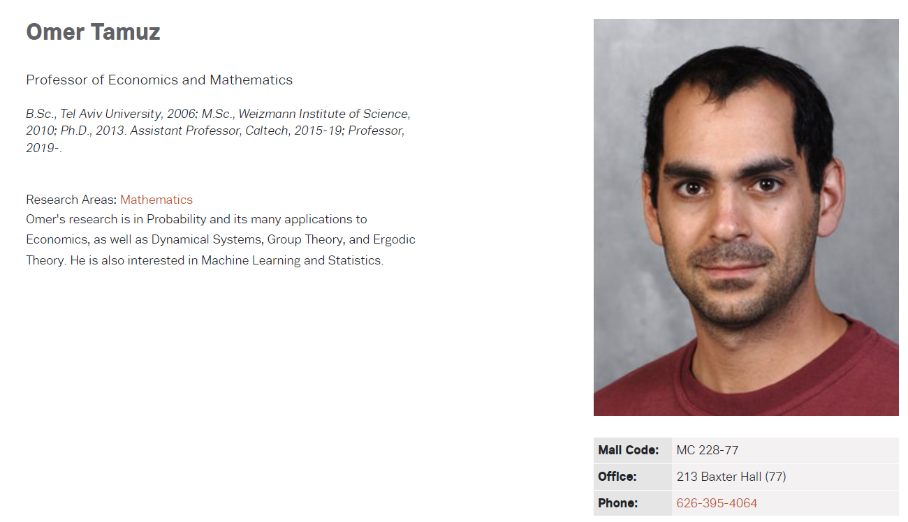 | [个人主页](https://tamuz.caltech.edu/) | 奥马尔的研究领域包括概率论及其在经济学中的诸多应用，以及动力系统、群论和遍历理论。他还对机器学习和统计学感兴趣。 | [Monotone additive statistics](https://tamuz.caltech.edu/papers/mas.pdf) |

##### 发表期刊

- **Journal of Economic Literature** 
- **Theoretical Economics**
- **Econometrica**
- **Electronic Journal of Probability**
- **Journal of Political Economy**
- **Israel Journal of Mathematics** 

相关领域 经济学 概率学 数学

##### 最新文献

[Monotone additive statistics](https://tamuz.caltech.edu/papers/mas.pdf)

https://youtube.com/watch?v=6t4Tjp1EspU

**Summary**

The talk discusses monotone additive statistics, their definitions, properties, and examples, emphasizing their applications in decision-making contexts like finance and algorithms.

本讲座讨论单调加法统计、其定义、属性和示例，强调其在金融和算法等决策环境中的应用。

**Highlights**

- 📊 Monotone additive statistics summarize distributions into single numbers. 单调可加统计量将分布总结为单个数字。
- 📈 Examples include expectation, maximum, and minimum statistics. 实例包括期望、最大和最小统计量。
- 🔄 Additivity is crucial for independent random variables. 加性对于独立随机变量至关重要。
- 🚗 Context involves decision-making in algorithms, like self-driving cars. 上下文涉及算法中的决策，如自动驾驶汽车。
- 💼 Applications in finance highlight the importance of these statistics. 金融领域的应用凸显了这些统计的重要性。
- 🔍 The main result shows limited types of monotone additive statistics.  主要结果显示了有限类型的单调相加统计。
- 🧠 Future research may explore extensions to vector-valued random variables. 未来的研究可能会探索向量值随机变量的扩展。

**Key Insights**

- 📉 Monotone additive statistics help in simplifying complex distributions into manageable metrics, aiding in decision-making. 单调相加统计有助于将复杂的分布简化为易于管理的指标，从而有助于决策。
- 🔗 The concept of stochastic dominance is central; it ensures that shifting mass in distributions leads to higher statistic values, reflecting improved outcomes. 随机优势的概念非常重要；它确保了在分布中移动质量会导致更高的统计量值，从而反映出更好的结果。
- 🌐 The relationship between statistics and independence highlights the necessity of additivity in real-world applications, ensuring consistent decision-making across contexts. 统计与独立性之间的关系突出了加法在实际应用中的必要性，确保了不同情境下决策的一致性。
- 💡 The framework of using bounded random variables provides a structured approach to analyze different distributions, facilitating comparisons and decisions. 使用有界随机变量的框架提供了分析不同分布的结构化方法，便于比较和决策。
- ⚖️ The results indicate that only a few statistics serve as monotone additive, suggesting a need for careful selection in applications to avoid undesirable outcomes. 结果表明，只有少数统计量可作为单调加法，这表明在应用中需要谨慎选择，以避免出现不理想的结果。
- 🧩 Extensions to non-negative or integer-valued random variables maintain the core principles, indicating robustness in various contexts. 对非负或整数值随机变量的扩展保持了核心原则，表明了在各种情况下的稳健性。
- 🔍 Ongoing research may uncover further complexities and applications, especially regarding vector-valued random variables and their implications in decision theory. 正在进行的研究可能会发现更多的复杂性和应用，特别是关于矢量值随机变量及其在决策理论中的意义。

## [芝加哥大学 ](https://www.uchicago.edu/)

### [数学系](https://mathematics.uchicago.edu/)

#### 研究领域

- [代数](https://mathematics.uchicago.edu/people/#algebra)
- [代数几何](https://mathematics.uchicago.edu/people/#algebraic-geometry)
- [代数拓扑](https://mathematics.uchicago.edu/people/#algebraic-topology)
- [分析](https://mathematics.uchicago.edu/people/#analysis)
- **[应用数学](https://mathematics.uchicago.edu/people/#applied-mathematics)**
- [组合学](https://mathematics.uchicago.edu/people/#combinatorics)
- [微分几何](https://mathematics.uchicago.edu/people/#differential-geometry)
- [动力系统](https://mathematics.uchicago.edu/people/#dynamical-systems)
- [遍历理论](https://mathematics.uchicago.edu/people/#ergodic-theory)
- **[金融数学](https://mathematics.uchicago.edu/people/#financial-mathematics)**
  - *Applied* *Mathematical Finance* 
  - *Mathematical Finance*
  - *Finance and Stochastics*
- [几何分析](https://mathematics.uchicago.edu/people/#geometric-analysis)
- [几何群论](https://mathematics.uchicago.edu/people/#geometric-group-theory)
- [几何测度论](https://mathematics.uchicago.edu/people/#geometric-measure-theory)
- [几何拓扑](https://mathematics.uchicago.edu/people/#geometric-topology)
- [几何学](https://mathematics.uchicago.edu/people/#geometry)
- [逻辑](https://mathematics.uchicago.edu/people/#logic)
- [数学物理](https://mathematics.uchicago.edu/people/#mathematical-physics)
- [数论](https://mathematics.uchicago.edu/people/#number-theory)
- [偏微分方程](https://mathematics.uchicago.edu/people/#partial-differential-equations)
- **[概率学](https://mathematics.uchicago.edu/people/#probability)**
- [表征理论](https://mathematics.uchicago.edu/people/#representation-theory)
- [理论计算机科学](https://mathematics.uchicago.edu/people/#theoretical-computer-science)
- [拓扑](https://mathematics.uchicago.edu/people/#topology)

#### [推荐教授](https://mathematics.uchicago.edu/people/)

| 研究领域 | 推荐教授                                                     | 个人主页                                                  | 研究内容                                                     | 最新文献                                                     |      |
| -------- | ------------------------------------------------------------ | --------------------------------------------------------- | ------------------------------------------------------------ | ------------------------------------------------------------ | ---- |
| 应用数学 | 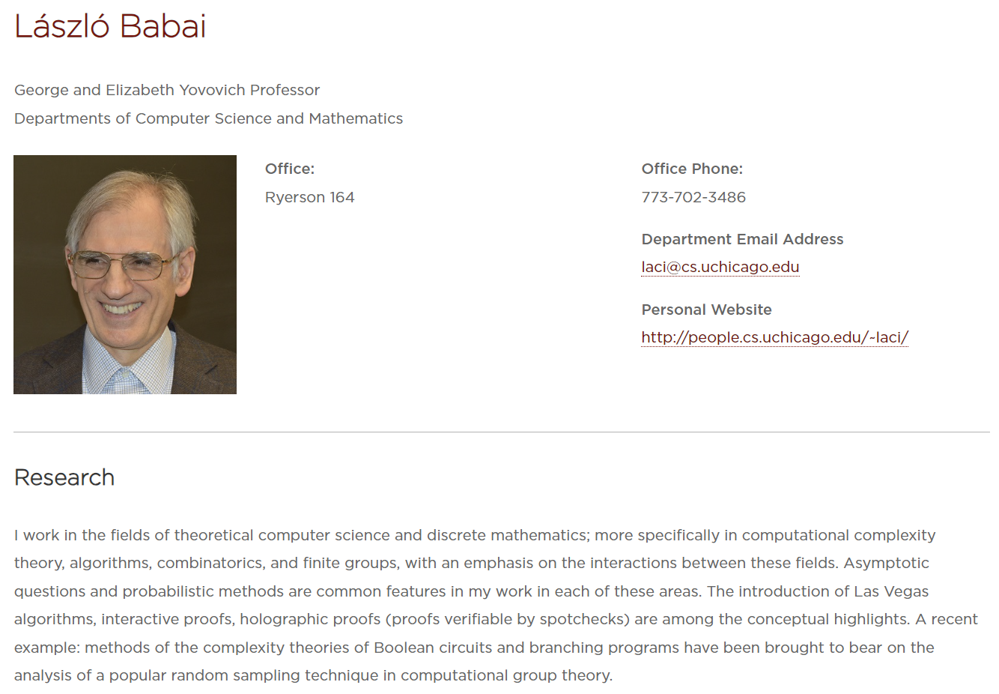 | [个人主页](http://people.cs.uchicago.edu/~laci/)          | 我的研究领域是理论计算机科学和离散数学，更具体地说是计算复杂性理论、算法、组合学和有限群，重点是这些领域之间的相互作用。渐近问题和概率方法是我在这些领域工作的共同特点。引入拉斯维加斯算法、交互式证明、全息证明（可通过抽查验证的证明）都是概念上的亮点。最近的一个例子是：布尔电路和分支程序复杂性理论的方法被用于分析计算群论中一种流行的随机抽样技术。 | [List-Decoding Homomorphism Codes with Arbitrary Codomains](https://drops.dagstuhl.de/entities/document/10.4230/LIPIcs.APPROX-RANDOM.2018.29) |      |
| 金融数学 | 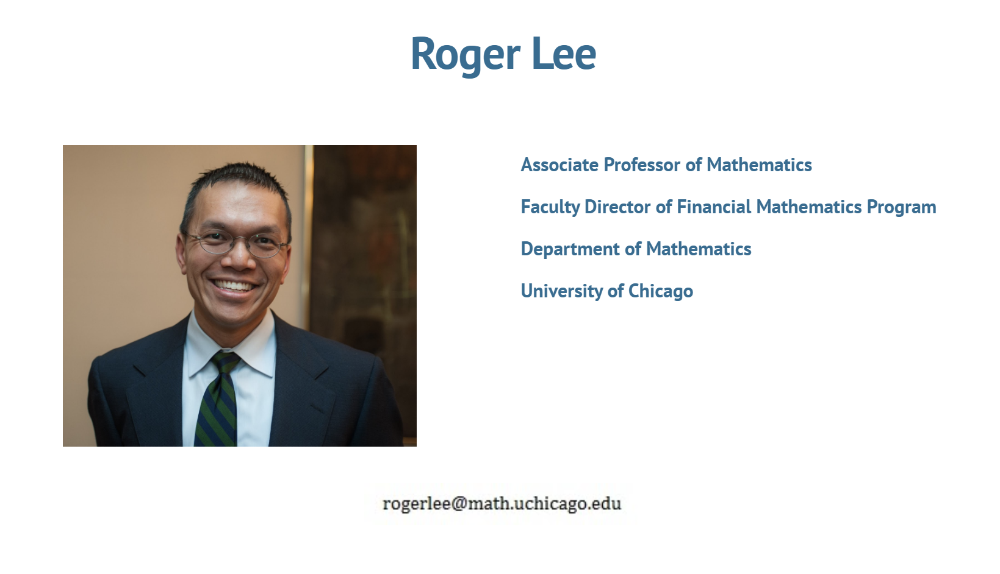 | [个人主页](https://sites.google.com/view/arbitroger/home) |                                                              | [All AMMs are CFMMs. All DeFi markets have invariants. A DeFi market is arbitrage-free if and only if it has an increasing invariant](https://arxiv.org/abs/2310.09782) [EMA-type trading strategies maximize utility under partial information](https://www.aimsciences.org/article/doi/10.3934/fmf.2023005) | ♥♥   |
| 概率学   | 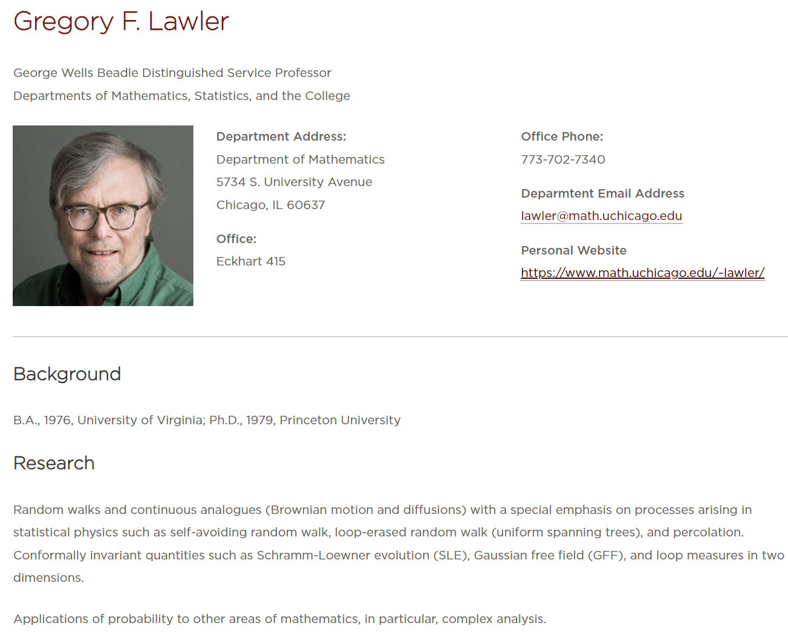 | [个人主页](https://www.math.uchicago.edu/~lawler/)        | 随机游走和连续类似物（布朗运动和扩散），特别强调统计物理学中出现的过程，如自回避随机游走、环状随机游走（均匀生成树）和渗流。共形不变量，如 Schramm-Loewner evolution (SLE)、Gaussian free field (GFF) 和二维环量。  概率在其他数学领域的应用，特别是复杂分析。 | [Conformally invariant loop measures ](https://eta.impa.br/dl/PL009.pdf)Proceedings 2018 ICM. |      |

金融数学相关研究

### [统计学](https://stat.uchicago.edu/)

#### [推荐教授](https://stat.uchicago.edu/people/)

| 研究领域                                                     | 推荐教授                                                     | 个人主页                                                     | 研究内容                                                     | 最新文献                                                     |
| ------------------------------------------------------------ | ------------------------------------------------------------ | ------------------------------------------------------------ | ------------------------------------------------------------ | ------------------------------------------------------------ |
| 计算机视觉                                                   | 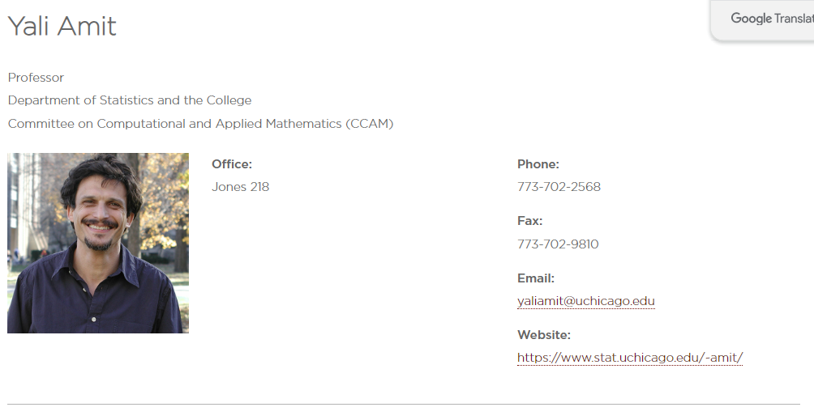 | **[个人主页](https://www.stat.uchicago.edu/~amit/)**         | **图像分析**：物体检测与识别 从粗到细的多类形状检测。 视觉选择和物体检测 形状识别 具有弹性变形的 2-D 和 3-D 图像匹配。 通过图形模板进行模型配准 **生物成像中的应用** 生物视觉系统的网络模型 用于不变检测和识别的网络架构 具有生物学习规则的形状识别网络模型。 **从视觉到语音识别的思想导入** 用于稳健单词分类的关系决策树 声学对象的稳健检测 | [Mufeng T., Yibo Y. and Amit, Y., Biologically Plausible Training Mechanisms for Self-Supervised Learning in Deep Networks, 2022, Front. Comput. Neurosci., 21 March 2022](https://www.frontiersin.org/articles/10.3389/fncom.2022.789253/full) , https://doi.org/10.3389/fncom.2022.789253 |
| 应用数学和计算数学                                           | 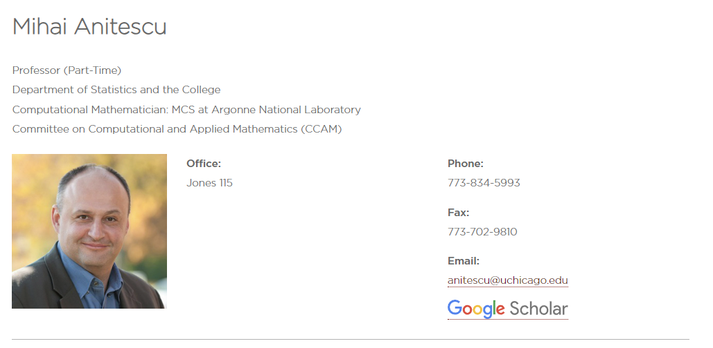 | [个人主页](https://scholar.google.com/citations?hl=en&user=2kwWnckAAAAJ) | Numerical Optimization. Uncertainty Quantification. Computational Statistics. Computational Science. Numerical Analysis. Applied Mathematics. | [Elastic-mode algorithms for mathematical programs with equilibrium constraints: global convergence and stationarity properties](https://scholar.google.com/citations?view_op=view_citation&hl=en&user=2kwWnckAAAAJ&citation_for_view=2kwWnckAAAAJ:YsMSGLbcyi4C) |
| Inverse Problems theory with applications in geophysical and medical imaging | 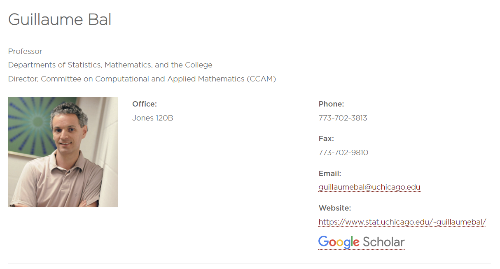 | [个人主页](https://www.stat.uchicago.edu/~guillaumebal/)     | Inverse Problems theory with applications in geophysical and medical imaging, and in particular inverse transport theory and the analysis of coupled-physics (hybrid) imaging modalities. Theory and computation of partial differential models with random coefficients and propagation of stochasticity with a wide range of applications including wave propagation in heterogeneous environments, time reversal, uncertainty quantification, and the stability of topological insulators. | [*Workshop on Mathematical Trends in Medical Imaging*, July 26, 2023](https://stat.uchicago.edu/news/article/workshop-on-mathematical-trends-in-medical-imaging/) [Time reversal by time-dependent perturbations ](https://hal.archives-ouvertes.fr/hal-01881455), with Mathias Fink and Olivier Pinaud, SIAM J. Appl. Math., 79(3): 754-780, 2019 |

### [经济学](https://economics.uchicago.edu/)

#### [推荐教授](https://economics.uchicago.edu/people/faculty)

| 研究领域                                                     | 推荐教授                                                     | 个人主页                                 | 研究内容                                                     | 最新文献                                                     |
| ------------------------------------------------------------ | ------------------------------------------------------------ | ---------------------------------------- | ------------------------------------------------------------ | ------------------------------------------------------------ |
| Macroeconomics, Economic Growth, Firm Dynamics, Innovation, Entrepreneurship. | 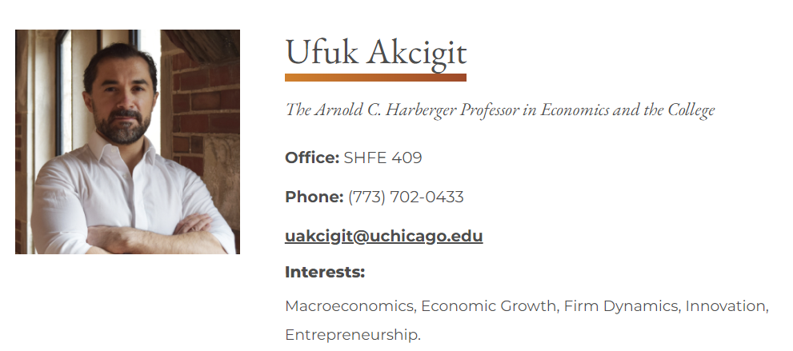 | [个人主页](https://www.ufukakcigit.com/) |                                                              | “[**What Happened to U.S. Business Dynamism?**](https://www.ufukakcigit.com/s/AA_fin.pdf)” (w/ Sina Ates). ***Journal of Political Economy\***, 2023, 131(8): 2059–2124. |
| Macroeconomics; public finance; political economy            | 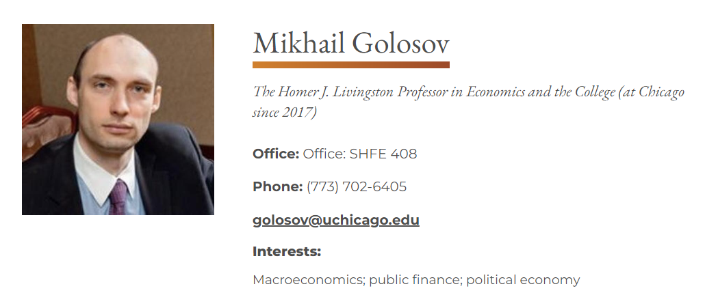 | [个人主页](http://golosov.uchicago.edu/) |                                                              | “[Inequality, Business Cycles, and Monetary-Fiscal Policy](https://voices.uchicago.edu/golosov/files/2017/01/BEGS2.pdf)” (with A. Bhandari, D. Evans and T. Sargent) **Econometrica**, (2021), 89(6): 2559-2599 |
| Time series econometrics; quantitative analysis of dynamic equilibrium models; asset pricing | 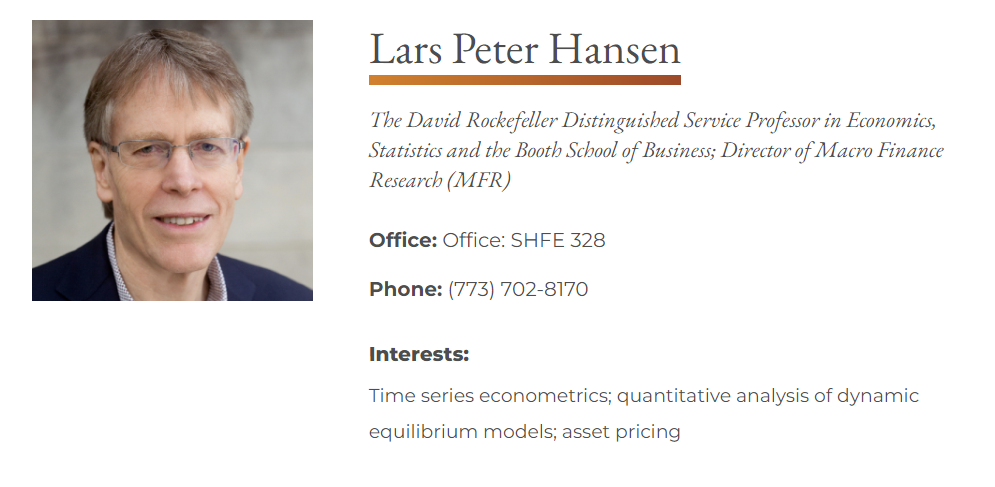 | [个人主页](https://larspeterhansen.org/) | (1) struggling with a complex and uncertain future; (2) implications of macroeconomic uncertainty for market and social valuation; and (3) understanding investor beliefs through asset market data | [Robust Inattentive Discrete Choice](https://larspeterhansen.org/lph_research/new-working-paper-robust-inattentive-discrete-choice/) |

## [华盛顿大学](https://www.washington.edu/)

[学术部门](https://www.washington.edu/about/academics/departments/)

### [数学系](https://math.washington.edu/?_gl=1*1jar8im*_ga*OTI4MDM0OTkwLjE3MjQyNTI1MDQ.*_ga_3T65WK0BM8*MTcyNDI1MjUwNC4xLjEuMTcyNDI1MjY5MS4wLjAuMA..*_gcl_au*MTUwOTM4NzY3Mi4xNzI0MjUyNTA0*_ga_JLHM9WH4JV*MTcyNDI1MjUwNC4xLjEuMTcyNDI1MjY5MS4wLjAuMA..)

#### [研究领域](https://math.washington.edu/fields/probability)

- [Algebra](https://math.washington.edu/fields/algebra)
- [Algebraic Combinatorics](https://math.washington.edu/fields/algebraic-combinatorics)
- [Algebraic Geometry](https://math.washington.edu/fields/algebraic-geometry)
- [Algebraic Topology](https://math.washington.edu/fields/algebraic-topology)
- [Applied Mathematics](https://math.washington.edu/fields/applied-mathematics)
- [Calculus](https://math.washington.edu/fields/calculus)
- [Combinatorics](https://math.washington.edu/fields/combinatorics)
- [Complex Analysis](https://math.washington.edu/fields/complex-analysis)
- [Complex Singularities](https://math.washington.edu/fields/complex-singularities)
- [Computational Geometry](https://math.washington.edu/fields/computational-geometry)
- [Computer Science](https://math.washington.edu/fields/computer-science)
- [Cryptography](https://math.washington.edu/fields/cryptography)
- [Data Science](https://math.washington.edu/fields/data-science)
- [Differential Geometry](https://math.washington.edu/fields/differential-geometry)
- [Discrete Geometry](https://math.washington.edu/fields/discrete-geometry)
- [Education](https://math.washington.edu/fields/education)
- [Ergodic Theory and Dynamical Systems](https://math.washington.edu/fields/ergodic-theory-and-dynamical-systems)
- [Finance](https://math.washington.edu/fields/finance)
- [Fractals](https://math.washington.edu/fields/fractals)
- [General Relativity](https://math.washington.edu/fields/general-relativity)
- [Geometric Combinatorics](https://math.washington.edu/fields/geometric-combinatorics)
- [Geometric Measure Theory](https://math.washington.edu/fields/geometric-measure-theory)
- [Geometry](https://math.washington.edu/fields/geometry)
- [Graph Theory](https://math.washington.edu/fields/graph-theory)
- [Inverse Problems](https://math.washington.edu/fields/inverse-problems)
- [Mathematical Physics](https://math.washington.edu/fields/mathematical-physics)
- [Non-Smooth Analysis](https://math.washington.edu/fields/non-smooth-analysis)
- [Noncommutative Algebra](https://math.washington.edu/fields/noncommutative-algebra)
- [Noncommutative Geometry](https://math.washington.edu/fields/noncommutative-geometry)
- [Number Theory](https://math.washington.edu/fields/number-theory)
- [Numerical Analysis](https://math.washington.edu/fields/numerical-analysis)
- [Operator Theory](https://math.washington.edu/fields/operator-theory)
- [Optimization and Variational Analysis](https://math.washington.edu/fields/optimization-and-variational-analysis)
- [Partial Differential Equations](https://math.washington.edu/fields/partial-differential-equations)
- [Probability](https://math.washington.edu/fields/probability)
- [Real and Harmonic Analysis](https://math.washington.edu/fields/real-and-harmonic-analysis)
- [Representation Theory of Lie Groups and Lie Algebras](https://math.washington.edu/fields/representation-theory-lie-groups-and-lie-algebras)
- [Software](https://math.washington.edu/fields/software)
- [Statistics](https://math.washington.edu/fields/statistics)
- [Theoretical Computer Science](https://math.washington.edu/fields/theoretical-computer-science)

### [统计学系](https://stat.uw.edu/?_gl=1*19bs487*_ga*OTI4MDM0OTkwLjE3MjQyNTI1MDQ.*_ga_3T65WK0BM8*MTcyNDI1MjUwNC4xLjEuMTcyNDI1MjY5MS4wLjAuMA..*_gcl_au*MTUwOTM4NzY3Mi4xNzI0MjUyNTA0*_ga_JLHM9WH4JV*MTcyNDI1MjUwNC4xLjEuMTcyNDI1MjY5MS4wLjAuMA..)

### [应用数学系](https://acms.washington.edu/?_gl=1*g9rsnc*_ga*OTI4MDM0OTkwLjE3MjQyNTI1MDQ.*_ga_3T65WK0BM8*MTcyNDI1MjUwNC4xLjEuMTcyNDI1MjY2Ni4wLjAuMA..*_gcl_au*MTUwOTM4NzY3Mi4xNzI0MjUyNTA0*_ga_JLHM9WH4JV*MTcyNDI1MjUwNC4xLjEuMTcyNDI1MjY2Ni4wLjAuMA..)

| 研究领域         | 推荐教授                                                     | 个人主页                                               | 研究内容                                                     | 最新文献                                                     |
| ---------------- | ------------------------------------------------------------ | ------------------------------------------------------ | ------------------------------------------------------------ | ------------------------------------------------------------ |
| 应用数学和统计学 | 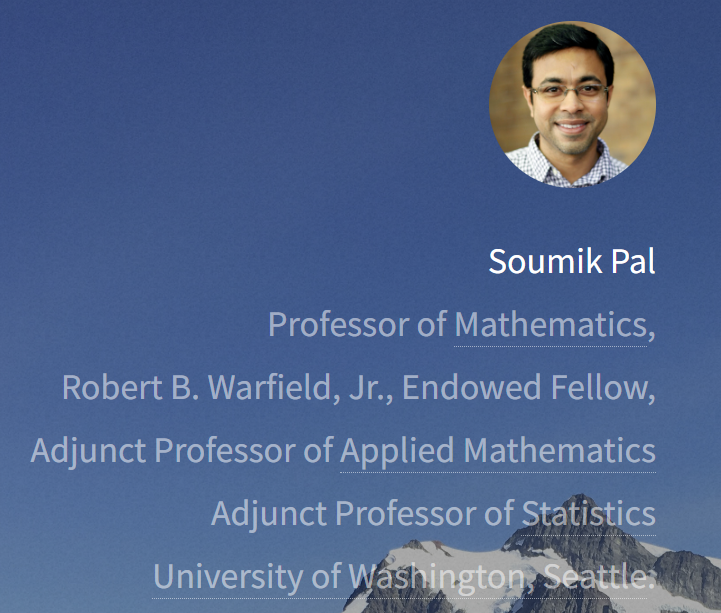 | [个人主页](https://sites.math.washington.edu/~soumik/) | 我的主要研究领域是概率。多年来，我的研究涵盖了各种主题，例如相互作用的布朗粒子系统、随机图和随机矩阵、随机投资组合理论、信息几何和演化随机树。我目前的研究兴趣是 Monge-Kantorovich[最优传输问题](https://www.google.com/books/edition/Topics_in_Optimal_Transportation/idyFAwAAQBAJ?hl=en&gbpv=0)及其最近在数据科学领域中的激动人心的[应用](https://optimaltransport.github.io/)。我的研究目前部分由 NSF 拨款 DMS-2052239、DMS-2134012（深度学习的规模数学）资助。 | On the difference between entropic cost and the optimal transport cost. Preprint available at arxiv.org/abs/1905.12206. 2019. |

## [哥伦比亚大学](https://www.columbia.edu/)

### [应用数学和应用物理学系](http://apam.columbia.edu/)

### [经济学](https://www8.gsb.columbia.edu/faculty-research/divisions/finance-economics)

### [数学系](http://www.math.columbia.edu/)

- [Overview](https://www.math.columbia.edu/research/overview/)
- [Algebraic Geometry](https://www.math.columbia.edu/research/algebraic-geometry/)
- [Geometry and Analysis](https://www.math.columbia.edu/research/geometry-and-analysis/)
- [Mathematical Physics](https://www.math.columbia.edu/research/mathematical-physics/)
- [Number Theory](https://www.math.columbia.edu/research/number-theory/)
- [Probability and Financial Mathematics](https://www.math.columbia.edu/research/probability-and-financial-mathematics/)
- [Topology](https://www.math.columbia.edu/research/topology/)

#### [推荐教授](https://www.math.columbia.edu/people/directory/)

### [统计学](http://stat.columbia.edu/)

#### [推荐教授](https://stat.columbia.edu/department-directory/faculty/)